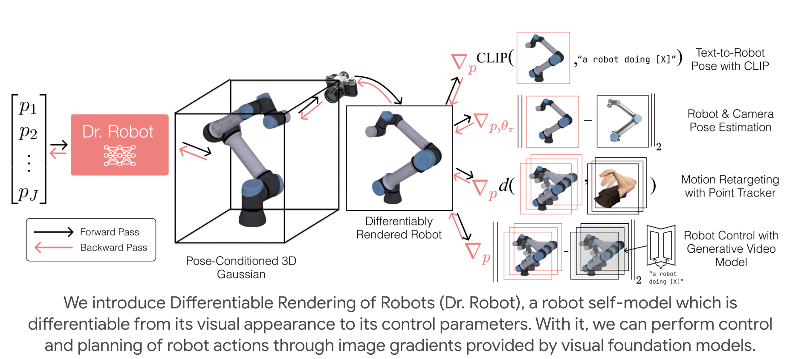

<div align="center">

# Differentiable Robot Rendering

[Project Page](https://drrobot.cs.columbia.edu/) | [Video](https://drrobot.cs.columbia.edu/assets/videos/video.mp4) | [Arxiv (TODO)]([TODO])

</div>

<div align="center">
  
</div>

<br>

This is the official repository for Differentiable Robot Rendering. It includes the code for training robot models and optimizing them at inference time with respect to image gradients. 

<!-- ### Overview

Much of this codebase is inherited from the [original 3D Splatting](https://github.com/graphdeco-inria/gaussian-splatting) codebase, which we simplified as much as possible.  -->


## Installation instructions

Our setup has been tested with [miniforge](https://github.com/conda-forge/miniforge) and CUDA 12.1. To install all of our dependencies, simply run

```bash
mamba create -n dr python=3.10 -y
mamba activate dr
mamba install pytorch torchvision torchaudio pytorch-cuda=12.1 -c pytorch -c nvidia
pip install gsplat
pip install tensorboard ray tqdm mujoco open3d plyfile pytorch-kinematics random-fourier-features-pytorch pytz gradio
```

The most tricky dependency of our codebase is [gsplat](https://github.com/nerfstudio-project/gsplat), which is used for rasterizing Gaussians. We recommend visiting their installation instructions if the plain `pip install` doesn't work. 

# Training

The training is divided into two phases
1. **Data generation**, which takes in a URDF file and generates randomly sampled combinations of images + camera poses + robot joint angles.
2. **Differentiable robot training stage**, which trains a canonical 3D Gaussian and a deformation field on the data generated. This part is subdivided into 3 stages:
   <ol type="a">
     <li>Canonical 3D Gaussian training</li>
     <li>Deformation field training</li>
     <li>Joint training</li>
   </ol>

## 1. Data Generation 

Our code generates data from a URDF specified as an XML file. We provide several standard robot URDFs from [Mujoco Menagerie](https://github.com/google-deepmind/mujoco_menagerie) to train on, which you can check out under `mujoco_menagerie/`. As an example, we will be using the UR5e robot arm. To generate data for this robot, simply run
```
python generate_robot_data.py --model_xml_dir mujoco_menagerie/universal_robots_ur5e
```
This script will launch many Mujoco workers to generate your data as fast as possible. 

The corresponding directory containing the data should appear under `data/` directory. 

```bash
data/
└── universal_robots_ur5e/
    ├── canonical_sample_0/
    │   ├── image_0.jpg
    │   ├── image_1.jpg
    │   ...
    │   ├── intrinsics.npy
    │   ├── extrinsics.npy
    │   ├── joint_positions.npy
    │   └── pc.ply
    ├── canonical_sample_1/
    ├── ...
    ├── sample_0/
    ├── sample_1/
    ├── ...
    ├── test_sample_0/
    ├── test_sample_1/
    ├── ...
```

P.S. this script is mostly standalone and quite hackable, so you may customize it to your needs.

## 2. Differentiable Robot Training

To train a differentiable robot model, run:

```bash
python train.py --dataset_path data/universal_robots_ur5e --experiment_name universal_robots_ur5e_experiment
```

This script will automatically run through all three stages of training. The latest robot model will be saved under `output/universal_robots_ur5e/`.

To visualize the model training process, you may run `tensorboard --logdir output/`
